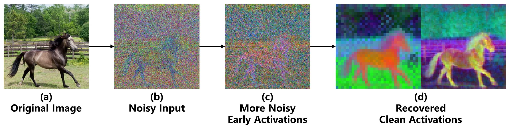

# Content Shift in Diffusion Features
Official repository of NeurIPS'24 paper [Suppress Content Shift: Better Diffusion Features via Off-the-Shelf Generation Techniques](https://arxiv.org/abs/2410.06719).

## Introduction
Diffusion feature is a quite popular way to utilize **generative** diffusion models for **discrimination**.
It's very simple: just extract some internal activations from a diffusion model, and then use these 2D features to replace image inputs of any discriminative model.  

When extracting diffusion features, it's a common practice to first add some noises to the input images, to mimic the denoising process.
Have you ever wondered why diffusion models can extract **clean** features from such **noisy** images?
We find that it's because the generative capability enables diffusion models to **imagine** some details to fill the blanks caused by noises.
  

Then there's an underlying risk.
Since some details in the features are imagined instead of real, it's possible that they drift from the original image.
This is how **content shift**, the core concept of this paper, happens.
  

How can we suppress content shift for better feature quality?
We don't doubt that there might be dedicated solutions to this problem in the future, but a simple yet effective start is always welcomed.
So here's our method: it only takes some off-the-shelf generation techniques and adds no new concepts.
Some certain generation techniques can inject additional guidance information into UNet to steer the generation direction.
Now we **steer the direction to align the generation back to the original image**.
This simple method is enough to bring obvious improvement to feature quality.

For more details, please check out our paper!

## Installation & Reproduction
Our current implementation mostly is based on our other [codebase: *generic diffsuion feature*](https://github.com/Darkbblue/generic-diffusion-feature). Please first follow the instructions there for installation.
Then copy the folders in this repo to *generic diffusion feature*.  

Our method involves three generation techniques: fine-grained prompts, ControlNet, and LoRA. While the first one is inherently supported, the other two requires additional preparation.  

**ControlNet**:
The integration of ControlNet is already supported by *generic diffusion feature*, but you need additional model weights.
If you have normal connection to 🤗 Diffusers server, they will be automatically downloaded so you don't need to do anything.
Otherwise, check out `feature/components/controlnet.py` in *generic diffusion feature*. Here you'll find three model ids, such as `lllyasviel/sd-controlnet-canny`. Google them to find the corresponding 🤗 Diffusers repo and manually download the weights locally. Then modify the model ids in the code to point to your local files.  

**LoRA**:
For your convenience, we have uploaded all the required LoRA weights to [Google Drive](https://drive.google.com/drive/folders/1bVRr-iQZYLT7MRoYm7k2dUEigvlbuKJD?usp=sharing).
These files are in .ckpt format. They should be converted back into 🤗 Diffusers format with the script provided in `helpers/convert_sd_to_diffusers.py` before using. This also requires downloading the Stable Diffusion v1.5 model weights locally.
If you prefer to learn how to train such LoRA weights yourself, we also provide a guide [here](./lora_guide.md).

For the detailed instructions to reproduce each task, check out the corresponding folders:
- `scarce_segmentation_gate`: label-scarce semantic segmentation.
- `correspondence_gate`: semantic correspondence.
- `segmentation`: semantic segmentation.

## Citation
```text
@inproceedings{meng2024suppresscontentshiftbetter,
  author       = {Benyuan Meng and
                  Qianqian Xu and
                  Zitai Wang and
                  Zhiyong Yang and
                  Xiaochun Cao and
                  Qingming Huang},
  title        = {Suppress Content Shift: Better Diffusion Features via Off-the-Shelf
                  Generation Techniques},
  booktitle    = {Annual Conference on Neural Information Processing Systems},
  year         = {2024},
  pages        = {18910--18939},
}
```
