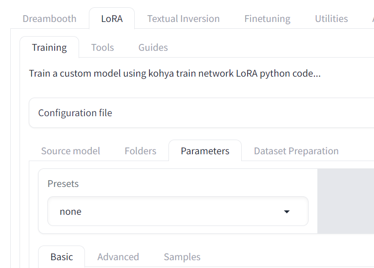

# LoRA Training Guide

## Tool Preparation
**Training platform**.
We recommend [kohya_ss](https://github.com/bmaltais/kohya_ss) as a generic platform for LoRA training. Please follow the instructions of kohya_ss for installation.  

**Captioner**.
During one specific step of LoRA training, you'll need to caption each training image using two different captioners.
One of them, WD14, is integrated in kohya_ss.
The other one, Kosmos-2, can be utilized with another [handy tool](https://github.com/lrzjason/kosmos-auto-captions).

## Dataset Preparation
**Getting images**.
You need and only need 30 images for LoRA training. Of course more images are beneficial, but it's not necessary.
So for efficiency we only use 30 images in this guide.
You can randomly sample 30 images from the entire training set of a specific dataset.

**Captioning images**.
It's important to provide captions of images in different styles.
In this guide, we will provide three captions for each image:
- One caption is empty. Yes, leave it empty! This is to train the unconditional generation part of the diffusion model.
- One capation is generated with WD14. It's a tagger, which means the captions will look like `solo, full_body, outdoors, sky, day, tree, no_humans, animal, grass, running, fence, animal_focus, horse`, i.e., a group of words instead of a complete sentence.
- Of course we also need a caption of complete sentences. This is done with Kosmos-2.

**Folder organization**.
You should make three copys of your training images and pair each copy with a group of captions. Each group of image-caption pairs should be put into a separate folder, named like `10_xxx`. Here `10` indicates the repeat of training, and 10 is the recommended setting for this hyper-parameter.
In the end, your folder structure should look like this:
```text
10_empty/
    image0.png
    image0.txt  # an empty file
    image1.png
    image1.txt
    ...
10_wd/
    image0.png
    image0.txt  # tags
    image1.png
    image1.txt
    ...
10_kosmos/
    image0.png
    image0.txt  # complete sentences
    image1.png
    image1.txt
    ...
```

## Training Settings
Go to this tab to toggle training settings:
  

- You can directly try the `sd15 - EDG_LoConOptiSettings`.
- Basic
    - `LoRA type`: Standard is the most basic type and a good start point. If you want stronger capability, try other types such as LoCon and LoHa.
    - `Epoch`: set a rather large number (e.g., 100) and manually pick a good checkpoint.
    - `Caption Extension`: **(important)** set this to .txt, otherwise your caption files will be ignored.
    - `Learning rate`: it's suggested to have 1e-4 for UNet and 5e-5 for Text Encoder.
    - `Network Rank & Alpha`: Rank should be set larger (e.g., 64) for real images (our case) while smaller for anime images. Alpha is usually set as half of Rank.
- Samples
    - `Sample every n epochs`: set to 1 to turn on sampling.
    - Then write some prompts, so that you can readily evaluate the quality of each checkpoint during training.

## Output Processing
The direct output is in .safetensors format.
Theoretically, you can directly load it into 🤗 Diffusers pipelines.
This function is also supported by *generic diffusion feature* by passing two arguments:
- `offline_lora` points to the folder that contains the .safetensors file.
- `offline_lora_filename` is the name of the .safetensors file.

Some certain types of LoRA training methods might not be fully supported by 🤗 Diffusers yet.
We don't know if they are supported when you read this guide, as 🤗 Diffusers devs are really enthusiastic to add new features.
If you do meet some issues, here's a workaround.  

First, `helpers/convert_diffusers_to_sd.py` allows you to convert the downloaded Stable Diffusion v1.5 weights into .ckpt format.
Then use kohya_ss to merge the .safetensors weight into the .ckpt weight, resulting in another .ckpt weight.
Finally, use `helpers/convert_sd_to_diffusers.py` to convert the .ckpt output back to a 🤗 Diffusers model folder.
Now you can load this LoRA weight by only setting `offline_lora` to the model folder and leave `offline_lora_filename` empty.  
